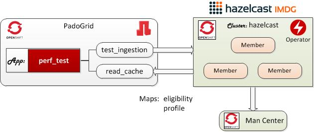

# Hazelcast OpenShift Operator

This bundle contains OpenShift operator configuration files for deploying Hazelcast and PadoGrid. Hazelcast is deployed using the Hazelcast Operator downloaded from the `hazelcast/hazelcast-operator` repo.

[https://github.com/hazelcast/hazelcast-operator](https://github.com/hazelcast/hazelcast-operator)

## Installing Bundle

 [*Driven by PadoGrid*](https://github.com/padogrid)

```bash
install_bundle -download bundle-hazelcast-4-k8s-oc_operator
```

## Use Case

This bundle installs PadoGrid and Hazelcast Kubernetes containers to run on CodeReady Container (CRC) or OpenShift Container Platform (OCP). It demonstrates how you can use the PadoGrid pod to ingest mock data into Hazelcast.



## Required Software

- PadoGrid 0.9.3-SNAPSHOT+ (09/06/2020)
- OpenShift Client, **oc**

## Directory Tree View

```console
oc_operator/
├── bin_sh
│   ├── build_app
│   ├── cleanup
│   ├── login_padogrid_pod
│   ├── setenv.sh
│   ├── start_hazelcast
│   ├── start_padogrid
│   ├── stop_hazelcast
│   └── stop_padogrid
├── etc
│   ├── hazelcast-enterprise-operator
│   │   └── hazelcast.yaml
│   └── hazelcast-operator
│       └── hazelcast.yaml
└── padogrid
    ├── padogrid.yaml
    └── pv-hostPath.yaml
```

## 1. Build Local Environment

Run `build_app` which initializes your local environment. This script downloads the Hazelcast Operator, updates `hazelcast.yaml` and sets the license key in the `hazelcast-enterprise-operator/secret.yaml` file.

```bash
cd_k8s oc_operator; cd bin_sh
./build_app
```
### Changing Container Versions

The conatiner image versions can be changed as needed in the files shown below.

```bash
# Change dir to the k8s installation directory
cd_k8s oc_operator
```

| Container                     | File                                                                |
| ----------------------------- | ------------------------------------------------------------------- |
| PadoGrid                      | padogrid/padogrid.yaml                                              | 
| Hazelcast Operator (OSS)      | hazelcast-operator/hazelcast-operator/operator.yaml                 | 
| Hazelcast Enterprise Operator | hazelcast-operator/hazelcast-enterprise-operator/operator-rhel.yaml | 

## 2. Create OpenShift Project

Let's create the `oc-operator` project. You can create a project with a different name but make sure replace `oc-operator` with your project name throughout this article.

```bash
oc new-project oc-operator
```

## 3. CRC Users: Create Mountable Persistent Volumes in Master Node

**If you are connected to OCP then you can skip this section.**

If you are logged onto CRC running on your local PC instead of OpenShift Container Platform (OCP), then we need to create additional persistent volumes using **hostPath** for PadoGrid. Let’s create these volumes in the master node as follows.

```bash
# Login to the master node
ssh -i ~/.crc/machines/crc/id_rsa core@$(crc ip)

# Create hostPath volumes. We only need one but let's create two (2)
# in case you want to run addional pods.
sudo mkdir -p /mnt/vol1
sudo mkdir -p /mnt/vol2
sudo chmod -R 777 /mnt/vol1
sudo chmod -R 777 /mnt/vol2
sudo chcon -R -t svirt_sandbox_file_t /mnt/vol1 /mnt/vol2
sudo restorecon -R /mnt/vol1 /mnt/vol2
exit
```

We will use the volumes created as follows:

| Container     | CDC File               | Container Path           | Volume Path |
| ------------- | ---------------------- | ------------------------ | ----------- |
| PadoGrid      | padogrid/padogrid.yaml | /opt/padogrid/workspaces | /mnt/vol?   |

We can now create the required persistent volumes using **hostPath** by executing the following.

```bash
cd_k8s oc_operator; cd padogrid
oc create -f pv-hostPath.yaml
```

## 4. Add User to `anyuid` SCC (Security Context Constraints)

PadoGrid runs as a non-root user that requires read/write permissions to the persistent volume. Let's add your project's **default** user to the **anyuid** SCC.

```bash
oc edit scc anyuid
```

**anyuid SCC:**

Add your project under the users: section. For example, if your project is `oc-operator` then add the following line.

```yaml
users:
- system:serviceaccount:oc-operator:default
```

## 5. Launch Hazelcast

By default, the `start_hazelcast` script launches Hazelcast Enterprise. To run, OSS, specify the `-oss` as shown in the sequent section.

### Hazelcast OSS

```bash
cd_k8s oc_operator; cd bin_sh
./start_hazelcast -oss
```

Wait till all three (3) Hazelcast services become available.

```bash
oc get svc
```

Output:

```console
NAME                         TYPE           CLUSTER-IP      EXTERNAL-IP   PORT(S)                        AGE
hazelcast-operator-metrics   ClusterIP      172.30.34.149   <none>        8383/TCP,8686/TCP              16m
hz-hazelcast                 ClusterIP      None            <none>        5701/TCP                       16m
hz-hazelcast-mancenter       LoadBalancer   172.30.16.62    <pending>     8080:32662/TCP,443:32400/TCP   16m
```

Run `oc expose svc` to expose services.

```bash
oc expose svc hz-hazelcast
oc expose svc hz-hazelcase-mancenter
```

Run `oc get route` to get the Management Center URL.

```bash
oc get route
```

Output:

```console
NAME                         HOST/PORT                                                                            PATH   SERVICES                     PORT           TERMINATION   WILDCARD
hazelcast-operator-metrics   hazelcast-operator-metrics-oc-operator.apps.7919-681139.cor00005-2.cna.ukcloud.com          hazelcast-operator-metrics   http-metrics                 None
hz-hazelcast                 hz-hazelcast-oc-operator.apps.7919-681139.cor00005-2.cna.ukcloud.com                        hz-hazelcast                 hzport                       None
hz-hazelcast-mancenter       hz-hazelcast-mancenter-oc-operator.apps.7919-681139.cor00005-2.cna.ukcloud.com              hz-hazelcast-mancenter       http                         None
```

Management Center URL: http://hz-hazelcast-mancenter-oc-operator.apps.7919-681139.cor00005-2.cna.ukcloud.com

### Hazelcast Enterprise

Launch Hazelcast Enterprise Operator and Hazelcast.

```bash
cd_k8s oc_operator; cd bin_sh
./start_hazelcast
```

Wait till all three (3) Hazelcast services become available.

```bash
oc get svc
```

Output:

```console
NAME                                    TYPE           CLUSTER-IP       EXTERNAL-IP   PORT(S)                        AGE
hazelcast-enterprise-operator-metrics   ClusterIP      172.30.143.238   <none>        8383/TCP,8686/TCP              47s
hz-hazelcast-enterprise                 ClusterIP      None             <none>        5701/TCP                       37s
hz-hazelcast-enterprise-mancenter       LoadBalancer   172.30.59.107    <pending>     8080:30756/TCP,443:32203/TCP   37s
```

Run `oc expose svc` to expose services.

```bash
oc expose svc hz-hazelcast-enterprise
oc expose svc hz-hazelcast-enterprise-mancenter
```

Run `oc get route` to get the Management Center URL.

```bash
oc get route
```

Output:

```console
NAME                                HOST/PORT                                                                                   PATH   SERVICES                            PORT           TERMINATION   WILDCARD
hazelcast-operator-metrics          hazelcast-operator-metrics-oc-operator.apps.7919-681139.cor00005-2.cna.ukcloud.com                 hazelcast-operator-metrics          http-metrics                 None
hz-hazelcast-enterprise             hz-hazelcast-enterprise-oc-operator.apps.7919-681139.cor00005-2.cna.ukcloud.com                    hz-hazelcast-enterprise             hzport                       None
hz-hazelcast-enterprise-mancenter   hz-hazelcast-enterprise-mancenter-oc-operator.apps.7919-681139.cor00005-2.cna.ukcloud.com          hz-hazelcast-enterprise-mancenter   http                         None
```

Management Center URL: http://hz-hazelcast-enterprise-mancenter-oc-operator.apps.7919-681139.cor00005-2.cna.ukcloud.com

## 6. Launch PadoGrid

### CRC Users

```bash
cd_k8s oc_operator; cd bin_sh
./start_padogrid local-storage
```

### OCP Users

```bash
cd_k8s oc_operator; cd bin_sh
./start_padogrid
```

## 7. Ingest Data

Login to the PadoGrid pod.

```bash
cd_k8s oc_operator; cd bin_sh
./login_padogrid_pod
```

Create the `perf_test` app and edit `hazelcast-client.xml` from the PadoGrid pod.

```bash
create_app
cd_app perf_test
vi etc/hazelcast-client.xml
```

### Hazelcast OSS

Replace the `<cluster-members>` element with the following in the `etc/hazelcast-client.xml` file. `hz-hazelcast` is service and  `oc-operator` is the project name.

```xml
                <kubernetes enabled="true">
                        <service-dns>hz-hazelcast.oc-operator.svc.cluster.local</service-dns>
                </kubernetes>
```

### Hazelcast Enterprise

Replace the `<cluster-members>` element with the following in the `etc/hazelcast-client.xml` file. `hz-hazelcast-enterprise` is service and  `oc-operator` is the project name.

```xml
                <kubernetes enabled="true">
                        <service-dns>hz-hazelcast-enterprise.oc-operator.svc.cluster.local</service-dns>
                </kubernetes>
```

Ingest blob data into Hazelcast.

```bash
cd_app perf_test; cd bin_sh
./test_ingestion -run
```

Read ingested data.

```bash
cd_app perf_test; cd bin_sh
./read_cache eligibility
./read_cache profile
```

The elibility and profile maps contain blobs. They are meant for carrying out performance tests with different payload sizes. If you want to ingest non-blobs, then you can ingest the Northwind (nw) data. To do so, you must first build the perf_test app and run the test_group script as shown below.

```bash
cd_app perf_test; cd bin_sh
./build_app

# After the build, run test_group
./test_group -run -prop ../etc/group-factory.properties
```

Read the nw data:

```bash
./read_cache nw/customers
./read_cache nw/orders
```

Exit from the PadoGrid pod.

```bash
exit
```

## 8. Teardown

### Hazelcast OSS

```bash
cd_k8s oc_operator; cd bin_sh
./cleanup -all -oss
```

### Hazelcast Enterprise

```bash
cd_k8s oc_operator; cd bin_sh
./cleanup -all
```
